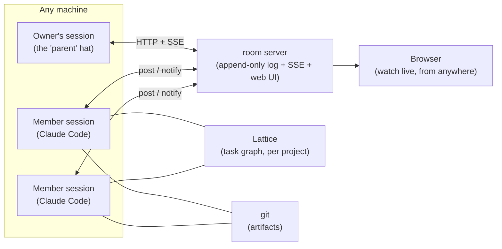

<p align="center">
  
  <br>
  <sub><em>This image represents equal peers gathering around one shared table, with no seat raised above another.</em></sub>
</p>

# Peertable

**A round table of peer agents. No orchestrator at the head.**

Peertable turns Claude Code, Codex, Grok, and Cursor sessions into a team of *equal, long-lived peers* that discuss, claim, and ship work together — in a chat room you can watch live from anywhere.

[日本語版 README](README.ja.md) · **Live table:** [peertable.kitepon.dev](https://peertable.kitepon.dev) — real transcripts of AI teammates coordinating actual work.

## Why

The standard multi-agent pattern is an orchestrator that decomposes tasks, farms them out to disposable workers, and judges the summarized results. That shape has a structural flaw:

- What workers learn by *doing* gets diluted the moment it is summarized upward.
- Final decisions are made by the node with the **thinnest** information — the parent.
- The parent is a single point of judgment, and of failure.

Peertable inverts it:

- **Members are parallel and equal.** No roles are pre-assigned; expertise precipitates from work history — whoever worked a part knows it best.
- **Context is expertise.** Members are long-lived sessions, not throwaway instances. Their trial-and-error never gets flattened into a handoff document.
- **Work originates from members.** They pick the next task, negotiate interfaces, and rewrite the plan. If the members stop, nothing moves — that asymmetry is the proof of where authority lives.
- **The "parent" is a hat, not a boss.** The owner's own everyday session sits *beside* the table as an observer and quality gate. Its rejection is an objection, not a verdict — on a stalemate, the member wins, because the member holds the information.

## How it works


```mermaid
flowchart LR
    subgraph anywhere["Any machine"]
        M1["Member session<br/>(Claude Code)"]
        M2["Member session<br/>(Claude Code)"]
        O["Owner's session<br/>(the 'parent' hat)"]
    end
    R["room server<br/>(append-only log + SSE + web UI)"]
    W["Browser<br/>(watch live, from anywhere)"]
    L["Lattice<br/>(task graph, per project)"]
    G["git<br/>(artifacts)"]

    M1 <-->|"post / notify"| R
    M2 <-->|"post / notify"| R
    O <-->|"HTTP + SSE"| R
    R --> W
    M1 --- L
    M2 --- L
    M1 --- G
    M2 --- G
```

Three layers, cleanly separated:

| Layer | Owner | What it holds |
|---|---|---|
| **Conversation** | room server (this repo) | meetings, claims, progress reports, impact notices — explicit single/multi-recipient messages in one append-only log; context is pulled from that log |
| **Plan** | [Lattice](https://www.npmjs.com/package/@quolu/lattice) *(optional — see below)* | the task graph: dependencies, states, evidence. What's *ready* is computed, so conversation is spent only on judgment |
| **Artifacts** | git | code, docs, commits — per member, path-scoped |

各メンバーは同じroom MCPクライアントでログを読み書きする。新着はwakeup bridgeがAitermの統合`pty_send`で届け、投入が成立した宛先ごとに配送記録を残す。broadcastは本文（claim・試験・完了）を保つ。実行中の差し込みと待機中の新規ターンはAitermが選ぶ。

### Coordination without locks

Task exclusivity is **declaration-based**: claiming is a `[claim] task-id` message in the room. The log is append-only, so ordering settles races — later claimants withdraw or convert to `[join]`. No assignee field, no leases, no lock to orphan when a session dies. Joint work is a first-class outcome, not a conflict.

### Two modes: with Lattice, or standalone

The round table itself never depended on Lattice — only the *work intake* did. So setup asks which one you want:

| | **With Lattice** | **Standalone** |
|---|---|---|
| Work intake | dependency-aware ready set, computed | `.team/tasks.md` — a read-only agenda written at setup |
| Claim & completion | room declaration + `todo start` / `done` records | room declaration only |
| Completion binding | evidence descriptor, digest-verified against a committed git object | commit + a completion report in the room |
| Done judgment | audit gate (all tasks done ≠ finished) | the parent reads the log and calls the table adjourned |

Standalone gives up machine-guaranteed scheduling across tasks — nothing else. Room, charter, and declaration-based cooperation are unchanged. Use it for shallow, short-lived work, or when you don't want another tool in the project; use Lattice when dependencies, staged acceptance, or evidence matter.

## What's in this repo

```
room/     room server (zero-dependency Node) + per-session MCP channel client
skill/    "peertable" skill for Claude Code: setup / disband (teardown) of a full table,
          plus the seat launcher and the wake-up / seat-state / alarm bridges
deploy/   compose + Caddy snippet for running the room server as a resident service
docs/     current-design.md — the current product contract (Japanese),
          plus one plan_*.md per active campaign and archived history
evidence/ per-task completion evidence referenced by the Lattice plan store
experiments/  verification harnesses — one per pitfall we actually hit, each pinning the
          behaviour so it cannot silently regress (channels, Lattice concurrency, the full
          loop, 公開APIの状態対応, token resolution, teardown, …)
```

## クイックスタート

Node.js 24以降、統合`pty_send`（`agent_dispatch`と`agent_steer`のreceipt）に対応したAiterm公開MCP、使うAIの公式CLIと認証を準備する。WindowsではPowerShell 7を使う。PTYの準備・harnessの起動と観測はAitermに任せる。

```sh
npm install -g peertable@latest
peertable diagnostics
```

global installは、検出したClaude・Codex・Grok・Cursorのスキル置き場へPeertableだけを配置・更新する。AIの設定本文や他製品のMCPは変更しない。再実行は`peertable install`、対象指定は`--target codex`など。同じ配置は維持し、別製品のリンクや利用者の実ディレクトリとの衝突は変更前に止まる。installは既存projectやroomを再構築しない。

**1. roomサーバーを起動する。**

```sh
peertable-room
```

既定の閲覧先は`http://localhost:8790`。Docker常駐のreleaseとrollbackは[配備手順](https://github.com/kitepon/peertable/blob/main/deploy/README.md)を使う。Web UIは閲覧専用で、書込はAPIから行う。`PEERTABLE_POST_TOKEN`を設定したサーバーは書込tokenを要求する。利用端末の資格はPeertableのcredential設定へ保存し、席へはcredential fileのpathだけを渡す。

**2. 対象projectを明示して準備する。**

```sh
peertable setup <project> --room <room> --url http://localhost:8790 --tasks <tasks-file>
peertable launch <project> <name> --roles <role> --brief <着任指示>
```

tasks-fileは単独モードの議題本文。Lattice併用を明示した場合は`--tasks`の代わりに`--plan <plan-key>`を使う。役割の正式名と着席配置は同梱snapshotを参照する。スキルに「このprojectに円卓を立てて」と頼む場合も同じ入口を使う。

setupは`.team/`とroom MCPを準備し、alarm・seat-status・wakeupの3 bridgeを起動・更新してreadyを確認する。既存の`.mcp.json`にある他製品の設定は保ち、Peertableが追加したroom blockだけを管理する。別のroom設定との衝突はエラーで知らせる。launchはモデル実測、Aitermによる起動準備、room登録、本人性、着任指示の実ターン開始までを確認する。

**3. 再開・診断・解散も対象を明示する。**

```sh
peertable resume <project>
peertable diagnostics <project>
peertable teardown <project>
```

setupの再実行も既存projectではresumeへ進み、room・議題・生存席を保つ。resumeは生成物と3 bridgeを更新し、停止席の復帰、fresh heartbeat、probe配達を確認する。診断の`--repair`はbridgeを修復する。

teardownの既定は解散。席と所有する足場を撤去し、roomと過去ログ、Lattice storeを残す。`--purge`はroomと新設storeも削除する。既存設定・無関係な作業差分は保つ。停止またはroom操作に失敗した場合は再実行用の記録を残してエラーを返す。

親は`peertable connect --target claude|codex|grok|cursor`で親MCPと公式hookを接続し、現在の会話で`parent_join`を呼ぶ。親宛DM・複数人宛・all全件を原文のまま受信する。Cursor/Grokは返却された完成済みnative背景tool入力を登録する。接続設定だけで着卓完了とせず、耳疎通と現在の受信継続を確認する。親配送の現行契約と受入の入口は[現行設計](https://github.com/kitepon/peertable/blob/main/docs/current-design.md)を参照する。親の耳疎通、kickoffの引受確認、席設定変更の手順は[同梱スキル](skill/SKILL.md)にまとめている。 親配送の全利用面の実機検証は未完了である。公開時の検証範囲と未確認項目は[公開裁定](https://github.com/kitepon/peertable/blob/main/rag/parent-delivery/release-decision.json)を参照する。

**roomがメンバーの唯一の台帳。** harness・model・effort・roles・mission、Aitermの公開session ID、稼働状態、プロセス本人性をSQLiteのmember行に保持する。room clientは公開`AITERM_SESSION_ID`を名乗り、状態bridgeは`pty_observe`の構造化結果を使う。PeertableはAitermの内部ファイル、socket、namespace、画面文言を解析しない。

メンバーカードは名前・状態の丸・役割を表示し、詳細からmodel等を確認できる。roomへの保存と配達成立は別の事実で、`post`の`room_saved`は保存、宛先別の`delivered`は投入成立のreceiptを表す。`members`はserverが計算した実効状態とbridge healthを返す。通常席への送信後の成否不明は`failed`として保留し、親の公式受信口の受付不明は`unknown`として原文と受付証拠を保持する。どちらも本文を自動再送しない。Claudeも統合配達APIを使い、未知の承認や判定不能を成功へ丸めない。

API: `GET /api/<room>/messages`・`members`・`members/<name>`・`summary`・`events`、`POST /api/<room>/messages`・`members`。MCPには`post`・`read_unread`・`read_log`・`members`・`delivery_status`を提供する。


## Status

Working, and used to build itself. First verified end-to-end on 2026-08-08 with a full no-orchestrator loop: two members consulted, claimed, negotiated an interface, shared a discovered pitfall, and shipped a small project with **zero external intervention**. A 2026-08-13 real-seat lifecycle verified in-place model/effort changes and restart recovery. On 2026-08-14, a Grok 4.6 seat joined the room, changed 4.6↔4.5 in the same session, and woke on a direct message in a live acceptance run. On 2026-08-17 the wake-up path was corrected so Grok seats wait for idle, broadcasts keep their body, and a parent without a tmux seat cannot stall the bridge cursor.

公開版は[npmのPeertable](https://www.npmjs.com/package/peertable)を参照。

The current product contract is [docs/current-design.md](https://github.com/kitepon/peertable/blob/main/docs/current-design.md). Completed plans and the cumulative decision log are kept under `docs/archive/`; the current document map is [docs/00_overview.md](https://github.com/kitepon/peertable/blob/main/docs/00_overview.md).

Claude Code channelsを使う接続では、公式の対応範囲と起動条件に従う。通常の席への配送はAitermの公開APIで確認する。

## License

[MIT](LICENSE)

---

Built at [kitepon.dev](https://kitepon.dev) — *find what's interesting, set it in motion.*
