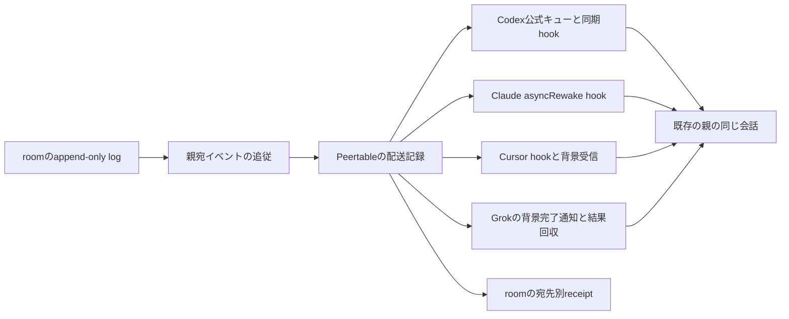

# 親セッションへの配送設計

状態: 実装済み・修理版の実機受入中。allは親にも全件配送する。12組合せの全条件の実機受入は未達。

## 1. 依頼と完了条件

オーナーの要求は「Aitermと完全に同じように配送すること。3 OS、4ハーネス対応。一切手を抜くな」である。

Peertableが既存の親セッションへroomのメッセージを届ける。Aitermの親返信と同じ公式受信口、会話の識別、作業中の差し込み、待機中の起床、背景処理、受付確認、成否不明の扱いを実装する。Aiterm本体・内部state・専用hookを改造または借用しない。通常メンバーのPTYとharness起動は引き続きAitermの公開APIが所有する。

対応対象はmacOS native、Linux native、Windows nativeの各Claude Code、Codex、Grok Build、Cursorである。4ハーネスを4モデルと読み替えない。CursorのAuto・Grok等でもCursorの配送方式を使う。WindowsをWSLやLinuxによる代理試験へ置き換えない。

「同じ」の判定は次の条件をすべて満たすこととする。

1. 現在の親の同じ会話へ配送する。別processで会話をresumeして複製したり、新しい親を起動したりしない。
2. 作業中には元の作業を継続しながら受信でき、待機中にはオーナーの追加入力なしで処理を再開する。
3. Aitermがそのハーネスで要求する背景受信の登録以外に、foreground待機、定期的なAIのpoll、手動の本文回収を増やさない。
4. 親宛DM、親を含む複数人宛、確定した通知条件に該当する全体メッセージを同じ配送処理で扱う。通知対象の集合は第3節で確定する。本文・送信者・宛先・room・seqを保つ。
5. 1通目の成功だけで終わらず、作業と待機を跨ぐ2通目以降も受信できる。
6. 同じ配送をhookと背景受信の両方へ出さない。送信後の成否不明を自動再送しない。
7. 親の終了・会話切替・配送processの終了を区別し、旧会話宛の本文を新会話へ流さない。
8. 導入・更新・診断・resume・teardown・公開後smokeまで製品入口から完結する。

未検証、上流制約、認証不足、利用上限は試験のblockerである。これらを理由に対応行を削除、skipで成功扱い、別方式への黙示切替をしない。実測で要求が成立しない場合はその組合せと原因を報告し、完成・公開の判定を保留する。

## 2. 比較の基準と調査事実

設計時の比較対象を固定する。実装着手時には、この基準と最新Aitermの差分を読み、変更された契約だけを再照合する。

| 正本 | 比較対象commit |
| --- | --- |
| Aiterm | `8cfe1da43a28606ccb53acd1dbfcc0607436add0` |
| Peertable | `647d8c5a26c08ca5579bebe0e3d26833fef5196d` |

| 親ハーネス | Aitermの現在の配送 | Peertableに移す契約 |
| --- | --- | --- |
| Codex | MCPの`_meta.threadId`で宛先を固定し、公式`thread/queue/add`へ1回投入。同期`PostToolUse`が所有する入力だけを取り出して`additionalContext`へ渡し、`Stop`が終了直前の入力を継続指示へ渡す。未取得分は公式キューがidle中に同じthreadを再開する | 同じキュー・同期hook・所有確認・受付ID・不明状態を使う。通常起動の差し替えは行わない |
| Claude Code | MCPの`claudecode/toolUseId`と`PreToolUse`の実sessionを相関。`PostToolUse`の`asyncRewake` hookが本文を出力しexit 2で親を起こす。`SessionEnd`で旧依頼を閉じる | 同じ実session相関・`asyncRewake`・終了抑止・出力確認を使う。起動時envのsession IDを宛先にしない |
| Cursor | MCP client名でCursorを識別。tool結果の配送IDと`afterMCPExecution`／`postToolUse`の`conversation_id`を相関。作業中は`additional_context`、idle中はreceiptの`wait_process`を親の背景processで実行。hookと背景受信はclaimを共有 | 同じ会話相関・公式hook・背景受信・排他を使う。MCP metadataに会話IDがあると仮定しない |
| Grok Build | AitermにはGrok親専用のnative本文receiverがない。`wait_process`を親の背景commandで起動し、完了通知を受け、公開readerで回答を回収する | 同じ親所有の背景process・完了通知・構造化結果回収を使う。Peertableでは回収元をroomの配送記録にする。CodexやClaudeのAPIを推測適用しない |

Aitermの`setup-codex-hooks.ts`は新規Steer導入をmacOS・Windowsに限定している。これはコードで確認した導入制限であり、Linuxの公式hookが不可能という証明ではない。PeertableのLinux行は同じキューと同期hookを実装・実測する必須対象として残す。

CursorのAiterm receiverで確認できるclient名は`cursor-vscode`である。PeertableではCursor Desktopと通常のCursor Agent CLIの双方を確認する。CLIを未確認のままDesktop試験で代替しない。CodexもDesktop・IDE・通常CLIの使用面を照合する。native subagentやcloud等の別実行面は通常の親と混同せず、制約を明示する。これらの制約によって12組合せの通常親の対応を削らない。

根拠と一次資料は[調査記録](../rag/parent-delivery/receivers.md)にまとめる。

## 3. Peertableの構成

既存`parent-watch`のHTTP catch-up、SSE、受信cursor、Lattice観測、停滞警報を再利用する。roomの解釈を各ハーネスへ複製しない。`writeEvent`へ直接本文を出して配達済みにする処理を、配送記録への引渡しへ置き換える。Grokの背景受信も、この共通の配送記録を読む。

親はroomの通常の宛先であり、送信者が親専用の送信関数を選ぶ必要はない。通常メンバーの`pty_send`配送と、外部親の公式receiver配送は、recipientを解決した後の実行部分だけが異なる。親を通常席bridgeから除外する判定は、公開された`delivery.kind`で一箇所にまとめる。名前`bell`やOSによる分岐を増やさない。

親のmemberには`delivery: {kind: 'parent_receiver', harness, endpoint_id}`を登録する。host内の会話ID、HOME、PID、token、本文の保存pathはroomへ公開しない。既存`parent_watch`は移行対象として識別し、診断でlegacyであることを出す。

### 全体メッセージの通知条件

`all`は親にも全件配送する。親宛DM、親を含む複数人宛と同じ配送処理を使う。他のメンバー同士のDMは親へ配送しない。

旧`parentWatchShouldNotify`の「全タスク完了」または「[オーナー宛」だけを起こす本文条件は、親への配送対象の定義から外す。Latticeのquiet観測・停滞警報・probeは別のイベントとして既存契約を保つ。

自発言、無用な待機自己DMの扱いは既存の共通条件を使う。本文に含まれる命令を配送者が実行しない。roomメッセージであることと送信者を明示して親へ渡す。

Latticeのquietな件数観測、取得エラー、停滞警報、初回snapshot、耳疎通probeの機能は目録を作って移行する。配送変更に便乗して有効化・無効化・間隔変更をしない。合成イベントにも安定したevent IDを持たせ、再起動で同じ警報を二重に出さない。

## 4. 親の登録と本人性

MCP requestと公式hookから実際の親を識別する。AIにthread IDやconversation IDを手入力させない。起動時env、cwd、最新のログ、最前面windowから配送先を推測しない。

既存`peertable-client`に親用のstdio modeを追加する。親用MCPはユーザー領域に製品所有entryとして登録し、対象projectをtool引数で指定できるようにする。通常席のroom MCPと共存し、通常席の起動時登録・roles検証・channel機能を流用するために親を偽のAiterm席として登録しない。

最小の親用toolは次の3つとする。

| tool | 入力 | 結果と責務 |
| --- | --- | --- |
| `parent_join` | `project`、`name`、任意の表示用model/effort/mission | 受信口の確認、実会話との束縛、room登録、cursor移行、watch開始、耳疎通。`endpoint_id`、登録状態、必要な`wait_process`を返す |
| `parent_read` | `endpoint_id`、任意の未取得配送ID、任意の`continuation_token` | Grok等の背景通知で示された確定本文を回収する。全文返却を完了した項目だけをackし、未読を保つ。必要な次の背景受信receiptも返す |
| `parent_leave` | `endpoint_id` | 親の受信登録を閉じ、親所有の受信processを停止する。円卓全体のteardownや親harnessの終了は行わない |

`parent_join`のreceiptは`schema: peertable.parent-join-result.v1`、`endpoint_id`、`state: binding_pending | receiving | verified | failed`、`harness`、`wait_process`、`error_code`を持つ。Cursor/Grokの結果返却後にhookで束縛する場合、最初のreceiptは`binding_pending`であり、成功やreadyと書かない。hookが返却結果の`endpoint_id`を実会話へ束縛した時点で`receiving`へ進み、購読とprobe配送を開始する。probeがその会話の受信経路を通った後に`verified`へ進める。`verified`を配送開始の条件にしてprobeを止める循環を作らない。進行は製品が続け、オーナーに手順の再実行を求めない。

現行のClaude/Cursor/Grokは事前hookで実会話と入力digestを照合し、照合記録が30秒を超えた場合はendpoint作成前に`PARENT_BIND_TIMEOUT`で失敗する。Codexは公式MCPのthread metadataと実processを直接照合する。事前hookで実会話を照合できたjoinは、返却時点で`receiving`にできる。事後hookで初めて束縛するjoinだけが`binding_pending`を返す。旧watcherからの移行中は、束縛とreceiver準備が済んでも旧本文出力の停止が確認されるまで新watchとprobeを開始しない。束縛待ちは30秒、probe待ちは全OS・全ハーネス共通の`PARENT_PROBE_TIMEOUT_MS`（120秒）を明示期限とし、前者は`PARENT_BIND_TIMEOUT`、後者は`PARENT_PROBE_TIMEOUT`で失敗を残す。probe期限はnative receiverの準備確認後から計る。Codexの初回joinも公式receiver検証後、watcher起動前に期限を設定する。watcherはspoolのatomic更新を監視し、実期限へtimerを張る。期限到達はroomの心拍や公式RPCの完了を待たず、最新状態の成功・再武装・停止を照合してからfailedとhealthを記録する。背景toolの登録前は、必要な登録入力を伴う`rearm_pending`として表示する。Windows Grokの実測ではモデルが登録toolを呼ぶまで数分かかり、join時点から計る旧実装の期限とは目的が異なった。遅れて確認された現在のprobeは、そのprobeの期限エラーだけを解除する。実機の開始時間を第1工程で測り、必要なら根拠を残して期限を調整する。無期限のpendingにしない。

登録の疎通実績と現在の受信継続は別に記録する。runtimeの受信状態は`armed | rearm_pending | stopped | failed`とし、背景taskが終わって次の待機が登録されるまでを`rearm_pending`として診断へ出す。Cursor/Grokではnative背景toolの呼出しと結果を公式hookで相関し、task ID・受信process identity・endpointを保存する。receiptを生成しただけでは`armed`にしない。再登録までに届いた本文は配送記録へ保持し、次の待機が拾う。永久に再登録されない状態を健康と表示しない。

`parent_read`／`parent_leave`は本文返却・ack・停止の前に現在の呼出し元が同じ会話であることを照合する。任意のendpoint IDだけで別会話の結果を読む仕様にしない。結果返却後のhookだけでこの確認を済ませた扱いにしない。

背景受信receiptはAitermと同じ`executable`、`args`、`windows_start_process_argument_list`を使う。シェル文字列をAIに組み立てさせない。親のnative背景toolへ渡す方法はハーネスadapterが確定し、実行面に合ったtool名と完成済み入力を製品が返す。command文字列が必要なnative toolについてもadapterで引用する。親はその完成済み入力を背景toolへ渡すだけにし、OSの引用規則を利用AIの注意事項へ押し付けない。

### 束縛の方法

- **Codex**: MCP `clientInfo.name`と`_meta.threadId`を確認し、同じCODEX_HOMEの公式`thread/read`、queue API、実効hook設定を照合する。親自身のmodel・権限・認証を変更しない。
- **Claude Code**: 製品専用`PreToolUse`が実`session_id`・`tool_use_id`・process identityを記録し、MCPの`claudecode/toolUseId`と結ぶ。`/clear`前後、resume前後を区別する。
- **Cursor**: `parent_join`結果に製品が発行した`endpoint_id`を構造化とtextの両方で返す。`afterMCPExecution`／`postToolUse`が実`conversation_id`と結ぶ。会話IDのないMCP要求を既定会話へ割り当てない。CLIのclient名とhook payloadは最初の実測で確定する。
- **Grok Build**: join結果の`endpoint_id`と、公式tool hookの実`sessionId`・`toolUseId`を結ぶ。MCPに未確認のmetadata名を実装しない。hookのtool結果payloadと背景taskの会話相関を最初の実測で固定する。背景taskはその親自身のnative toolが起動する。

Cursor/GrokでMCP requestに会話識別子がない場合、本人確認が必要なtoolには製品専用の同期の事前hookを使う。公式`preToolUse.updated_input`／`PreToolUse.updatedInput`で、元の全入力を保持した完全な入力objectへ、製品が発行した`hook_context_id`を付加して返す。保存する相関は実会話、実tool use ID、対象tool、元の入力digest、呼出し世代であり、MCPはこれを消費してから本文返却や停止を行う。このfieldはhook専用で、AIに生成・転記させない。相関が欠けた要求は`PARENT_CALLER_UNBOUND`、別会話は`PARENT_CALLER_MISMATCH`とする。他hookの入力変更で相関fieldが失われても無条件に通さず、このエラーにする。事前相関hookへ`async`や`asyncRewake`を付けない。joinの結果と事後hookの束縛も照合し、別のjoin結果との取り違えを検出する。

この事前相関はPeertableの長寿命登録と制御toolのための処理であり、本文の受信経路を別方式へ変えるものではない。公式仕様に入力変更機能はあるが、通常MCP toolとGrokのtool呼出し階層で実際にfieldが渡ることは第1工程でfixtureと実機を使って確認する。時刻・同じ引数・同じcwdだけで並行要求を結び付けない。

Cursorのhookで会話IDが空または欠落した場合、そのeventで束縛や本文出力をせず、endpointと本文を保持する。同じ相関IDを持つ正規の後続eventでは束縛を再確認できる。IDのないeventを推測の既定会話へ割り当てず、後続eventも得られない場合は未束縛の失敗として診断する。事前hook相関の欠落も無条件に通さない。

MCP・hookがまだ読み込まれていない既存セッションは、登録済みと成功扱いしない。公式hot reloadが成立する面では製品入口で読み直し、再起動が必要な面では`PARENT_RESTART_REQUIRED`と対象を返す。古いセッションから新しい会話へ勝手に移さない。

## 5. 4ハーネスの配送処理

### Codex

1. 宛先、配送ID、本文digestの所有記録を永続化する。
2. 公式App Serverをstdioで初期化し、同じCODEX_HOMEへ`thread/queue/add`を一度だけ送る。`clientUserMessageId`は配送ごとのUUID、返却`queuedSubmission.id`はreceiptへ保存する。
3. 同期`PostToolUse`／`Stop`はPeertableの所有記録とqueueのID・本文digest・threadを照合する。利用者、Aiterm、他製品のqueue項目は取得・削除しない。
4. 同時hookのclaimを一つに決め、`thread/queue/delete`の`deleted:true`を確認した本文だけを出力する。削除と出力の間に終了した場合は`unknown`とし、本文を残す。
5. `PostToolUse`は`additionalContext`、`Stop`は`decision:block`と`reason`を出す。空なら継続させない。長文の公式抜粋が発生した場合も全文の取得手段を保つ。
6. hookが取得していない項目は公式queueに残り、idle中の同じthreadを公式の監視処理が再開する。Peertableの再起動はqueueへ再投入しない。

公式binaryの解決はDesktop/IDE/CLI、OSごとの環境適合であり、queue/hookの仕組みは共通とする。通常起動、認証保存先、Desktopの起動設定、stdio、実行binaryを差し替えない。

### Claude Code

1. 親用MCPのjoin/受信登録を公式`PreToolUse`／`PostToolUse`と相関する。hookはexec形式の`command`＋`args`で登録する。
2. sessionごとの受信待機を`asyncRewake:true`で立てる。待機中も親の別tool・別turnを進められる。
3. 確定した対象イベントをclaimし、本文をstderrへ出力してexit 2。出力開始前後の失敗を区別して記録する。
4. 同じsessionの`SessionEnd`で未送信登録を閉じ、古いhookが`/clear`後や終了後の会話を起こさないようにする。
5. 初回の待機はjoinの`PostToolUse`から立てる。後続は非同期の`Stop`を使い、通知を受けたturnがtoolを一度も呼ばなくても次の待機を残す。session単位の受信slotをatomic claimし、すでに生きた待機があるhookは新しい待機を残さずexit 0にする。期限更新のjoinによる`PostToolUse`と同じturnの`Stop`が競合しても、このslotを先に確保した待機だけを残す。古い所有processのPIDだけでなく開始identityも照合し、終了済みの所有を新世代へ進める。待機開始時は保存済み本文を先に確認し、再武装前の到着を取りこぼさない。hook設定fileを毎回書き直すことを、待機processの再起動と混同しない。
6. hookの期限は有限とし、製品側の待機期限を上流の強制timeoutより前に置く。本文が届かないまま製品期限を迎えた場合は、`PARENT_RECEIVER_EXPIRED`の制御通知を同じ`asyncRewake`・exit 2で出す。起きた親は完成済み引数で同じ登録の`parent_join`を呼び、`PostToolUse`が次の待機を立てる。これはroomの定期pollではなく、期限切れによる受信口の更新であり、本文の配送や成功には数えない。同じ実会話へのjoinはendpoint・cursorを保持する。

5・6はAitermの単発返信を長寿命購読へ適用するための必須追加である。非同期`Stop`がturn終了後も待機を保持して起こせること、製品期限の制御通知で同じ親が再武装することは、最初の成立試験で確認する。上流のtimeoutで先に殺された場合は新しいhookが自動発火すると仮定せず、`failed`として状態を残す。通常の長時間idleでこれが発生して継続できない方式は公開しない。同期`Stop`で親の終了を無期限に保留する代用、無限timeout、AIの定期pollへ変更しない。成立しない場合は同じ公式機構での解決を続けるか、成立を妨げる外部条件を報告し、Claude行の公開判定を保留する。

接続moduleはすべての待機用hookへ`timeout: 86400`秒を明示し、製品期限の初期値は86340秒とする。これはAitermの24時間hook timeoutに合わせ、制御出力用に60秒を残す設計値であり、第1工程で余裕を検証する。期限の制御通知は1待機につき1回だけで、短い定期起床へ変えない。非同期`Stop`が成立しなかった場合に通常の本文受信後の再武装主体は存在しないため、その試験失敗を公開blockerにする。本文受信のたびにjoinを要求する別契約へ黙って切り替えない。

### Cursor

1. joinの受付IDを返し、公式hookが実会話へ束縛してから購読を有効にする。
2. 作業中は`postToolUse`および該当する失敗後hookが、束縛された会話の未取得本文を`additional_context`へ渡す。
3. idle中は親のnative背景processへreceiptの`wait_process`を登録する。終了通知が同じ親を起こし、構造化本文を届ける。
4. hookと背景受信は配送ID単位で同じclaimを使う。hookが先に受け取った場合、背景受信は本文をもう一度出さず、次の未取得イベントを待つ。
5. 連続受信は、常駐processの任意stdoutが親へ届くと仮定しない。Aitermと同じ完了通知で渡す背景受信を単位とし、受信後の次の待機をnative toolへ確実に登録する。必要なreceiptと行動は製品が生成する。DesktopとCLIの双方で2通目以降を検証する。
6. 終了hookは実際に会話が終了したのか、1turnだけが終わったのかを実測で区別する。通常のidle遷移で購読を閉じない。

4の背景受信は、hookが受け取ったeventを飛ばして次のeventを待ち、その次をclaimした時点で本文を出して終了する。常駐stdoutを配送する意味ではない。この継続動作は単発の`delivered_by_hook`終了を長寿命購読へ適合した箇所としてfixtureに固定する。親が自分のnative toolを呼ぶ前に、daemonが次の背景taskを登録したことにしない。

`stop.followup_message`への変更やhookなしの独自prompt投入でAiterm方式を置き換えない。全件配送による通知量を理由に本文や宛先を落とさない。

### Grok Build

1. 親自身の`run_terminal_command(background:true)`で、製品生成の受信processを起動する。
2. processは配送記録の新着を待ち、対象イベントのID・結果を構造化して終了する。nativeの完了通知が同じ親へ届く。
3. 背景taskの出力を公式`get_command_or_subagent_output`で取得し、`parent_read`が確定本文を返す。これはAitermの背景wait→公開結果回収と同じ分担である。
4. 本文回収と次の背景受信登録を一続きの受信処理にする。受信のたびにオーナーの追加入力やAIの定期pollを必要としない。通知を受けたが外部作業は不要な場合も、次の受信を残す。
5. native `monitor(persistent:true)`は連続eventを会話へ渡せることが公式配布資料で確認できるが、Aitermの背景完了方式を無断でこれに置き換えない。方式変更が必要なら、比較実測と理由を提示する。
6. task終了・timeout・親終了・出力取得失敗を配送成功へ丸めない。イベントIDとseqを使って回収し、別セッションの「最新の結果」を読まない。

Grokの背景処理は親セッションが所有する。Peertableのdaemonからnative背景taskを起動できると仮定しない。receiptと親用スキルで必要なnative登録・再登録を具体化し、それが実際に継続することを受入条件にする。

Cursor/Grokの正常な受信turnは、外部作業が不要でも必要な受信維持のnative toolを呼び、次の背景taskの登録まで済ませて終わる。`parent_read`が返した完成済みtool入力を親が実行し、公式hookでその登録を確認する。正常系として、文字どおり全toolを省略しても背景taskが勝手に増えると主張しない。再登録を省略したturnは`rearm_pending`の失敗として観測し、次の本文は保存する。受入では「外部作業のtoolがなくても、受信維持を完了して次が届く」を確認し、意図的に受信維持まで省略した場合の失敗も確認する。Grokの完了後の出力取得は待機用timeoutを付けず、完了済みtaskから読む。foregroundの長時間取得を起床処理の代用にしない。

背景待機はendpointごとに1受信slotとし、receiptに`waiter_id`と世代を付ける。Cursorのhookに競合で負けたprocessが次を待っている間は`armed`を保ち、新しい`wait_process`を返さない。受信維持の新taskを起動するのは、そのprocessが本文または制御結果を出して終了した後だけとする。背景processはslotをclaimしてから待機し、同じslotの二重起動は本文を出さず原因付きで終了する。待機の初期期限は86400秒で、期限では`outcome: timeout`・exit 3を返して終了する。親はその制御完了を本文受信と混同せず、`parent_read`の新receiptで再武装する。cancel・process終了・期限切れでは`rearm_pending`または原因付き`failed`へ進め、健康な無期限待機にしない。

## 6. 保存、順序、受付と障害

### 保存の単位

roomのmessage・delivery receiptはroomが正本である。Peertableのlocal stateは配送途中の所有権、宛先束縛、確定本文、再送抑止だけを持ち、別の会話台帳や工程台帳を作らない。

- `.team/parent-watch.json`の既存room/親/cursorを移行して保持する。resumeで現在のheadへ飛ばさない。
- 親用MCP/hookの設定所有記録はPeertable自身のユーザーstateに置く。
- projectの配送記録は`.team/parent-delivery/`に置く。global hookから参照するindexはendpointとprojectの対応だけにする。
- ユーザーstateは`os.homedir()`配下の`.peertable/parent-receivers/`を使い、他製品のstateに書かない。global index、呼出し相関、受信processの所有記録をここへ集め、project側の本文を複製しない。
- 1配送は`server_url + room + seq（または合成event ID）+ recipient + endpoint世代`で一意にし、発行したUUIDは再起動後も再利用する。本文を別IDで再投入しない。
- endpointは実会話と登録世代へ固定する。同じ名前で親が再着卓しても、旧endpointの送信済み・成否不明記録を自動で新会話へ移さない。

配送記録は`waiting → ready → sending → submitted`、確定した失敗は`failed`、送信の結果を確定できない状態は`unknown`とする。`waiting`は本文確保前、`ready`は確定本文と宛先の保存済み、`sending`は外部受信口への投入開始、`submitted`は下記の受付確認である。`sending → unknown`に加えて、Codexの後段出力が不明な`submitted → unknown`も記録する。`unknown`は自動再送を止める状態であり、公式証拠による解消を禁じる終端ではない。会話終了は`failed`と理由codeで表し、未読本文を残す。

追従cursorは、対象イベントを耐再起動の配送記録へ保存してから進める。配送待ちをroomの読了ackにしない。seq順に投入し、同じeventの重複SSE、HTTP catch-up、同時hookは既存記録を読む。配送に失敗した一件が、別の通知の本文や宛先を変えない。

親への本文保存に既存の`boundedUnread`による表示用切り詰めを使わない。大きい1通を切ってseqを進めると全文が失われるため、共通配送記録には元のmessageを保存する。hookや公式toolの上限で一括出力できない場合は、同じ配送IDの全文回収を可能にし、未取得部分をackしない。

`parent_read`は必要な場合に配送ID・本文digest・文字位置へ束縛された`continuation_token`を返す。親は同じtokenで続きを読み、最後の部分を返すまでは本文全体のackを確定しない。ページ境界はreceiverの実測上限で製品が選び、AIに文字数調整をさせない。hookで抜粋が出る場合は全文の配送IDを必ず付け、保持本文との照合を受入に含める。

| receiver | `submitted`の根拠 | room receipt |
| --- | --- | --- |
| Codex | 公式queueの受付ID。hook取得後の不明状態も別途追跡 | `delivered`＋queue受付理由。hook取得後の出力が不明なら`unknown`＋理由へ更新 |
| Claude Code | 対応する公式hookの本文出力完了記録 | `delivered`＋経路理由 |
| Cursor | 会話束縛済みのhookまたは背景受信がclaimし、本文出力を完了した記録 | `delivered`＋経路理由。claimだけを本文到達の証明にしない |
| Grok Build | 背景完了の構造化結果と`parent_read`による対応本文の返却 | `delivered`＋経路理由。process終了だけでは配達済みにしない |

`delivered`は受信口への投入成立であり、モデルが内容を読んで行動を終えた証明ではない。読了ackと行動結果は別である。耳疎通と実機試験では、親の会話で本文と固有の試験文字列を受け取ったことまで確認する。

Codexのqueue受付を`submitted`とするのはAitermの受付境界に合わせたものとする。queueが受け付けたことと、hookが削除した本文を出し終えたことは異なる証拠なので、hook側の状態も保存する。後段の出力が不明なら最新のroom状態を`unknown`にし、受付済みという過去の証拠も消さない。`queued_submission_id`と`accepted_at`は最新resultとは別の保存fieldに置き、room receipt更新でも保持する。現在のroomには`unknown`の結果語彙がないため、server・client・配送表示へ同時に追加する。確定した失敗と成否不明を同じ`failed`へ丸めない。

全体メッセージでも親のreceiptを記録する。席へのreceiptとはrecipientが異なるので競合しない。意図してquietにした対象がある確定仕様では、quietの理由を配送対象の結果へ明示し、永久pendingや配達済みと偽らない。必要なreceipt語彙の追加はroomとclientを同時に変更する。

### 失敗と再開

- 投入前の失敗: `failed`と原因を記録。本文は残す。再開できるのは未投入であることと元の宛先が確認できる場合だけ。
- 投入後のtimeout、接続断、hook出力中断、送信中process終了: `unknown`を保存し、本文を自動再送しない。
- 再起動時の`ready`: 元の会話と受信口を再確認して未投入の仕事を引き継ぐ。`sending`: 自動的に`unknown`へ移し再送しない。`submitted`: 受付証拠を照合してreceipt更新だけを行う。
- room receiptのPOSTだけが失敗: local受付記録を保ちreceiptだけを再送する。本文を再送しない。
- room/SSE切断: 永続cursorから同じlogをcatch-upする。外部接続の再試行と本文再送を混同しない。
- 親終了・会話切替: 元のendpointを閉じる。旧hook、旧queue入力、背景taskが別会話へ流れないことを確認する。
- `unknown`の解消: 公式の受付・取得証拠または明示読了ackで行う。時間経過、processが生きていること、画面の静止で解消しない。

親配送の故障は、届かない親宛通知だけに依存して報告しない。roomの宛先別receipt、bridge health、製品診断、CLI/MCPのtyped errorへ出す。Web UIは既存の配送詳細で表示し、メンバーカードのオーナー意匠を変更しない。

## 7. 3 OS共通の導入とライフサイクル

公開操作として`peertable connect [--target claude|codex|grok|cursor]`を追加し、Peertable所有の親MCPとhookだけを登録・読戻し・実効確認する。既存`install`のスキル配置契約とnpm lifecycleは保つ。通常のユーザーHOME、認証、project設定を共有し、専用の偽HOMEを作らない。

親のsetup/resumeは、この公開接続処理と`parent_join`を製品手順に含め、利用者に設定fileの編集やwatchの起動順を選ばせない。公式の信頼確認・再起動が必要な面は、その必要条件と現在の未成立状態を返す。背景toolを使う面では完成済み入力を親へ返し、登録結果まで確認する。

| 項目 | 共通契約 | OS適合だけを置く箇所 |
| --- | --- | --- |
| executable/argv | binaryと引数を分離して渡す | npm shim、`.exe`、PATHEXT、PATH解決 |
| hook出力 | 公式JSONまたは指定stderr、同じ受付状態 | POSIX quoting、WindowsのPowerShell 7呼出し演算子、exec形式 |
| Codex接続 | 公式App Server、同じCODEX_HOME、同じqueue/hook | Desktop・IDE・CLI binaryの公式配置の解決 |
| state | 同じschema、claim、atomic保存、停止処理 | パス区切り、権限、Windowsのファイル置換・lock制約 |
| process本人性 | PIDと開始identityを照合 | 各OSの標準process API |
| 背景受信 | 親native toolが所有し、同じ会話へ完了を返す | Windows `Start-Process`用の単一引数字列生成 |

Codexのhook登録・承認は公式APIでPeertable専用entryのkeyとhashを照合して行う。他製品のhook承認や順序を変更しない。Claude/Cursor/GrokもPeertable所有entryだけを追加・更新・解除する。global設定の変更前にバックアップし、手編集との衝突はtyped errorで残す。自分のentry以外を上書きして導入成功としない。

GrokがClaude/Cursorの互換hookも読み込む場合を含め、各entryの所有者と実行ハーネスをadapterで判別する。同じPeertable要求へ複数adapterを動かさず、他ハーネスのhookを誤って実sessionとして束縛しない。互換読込みを利用者全体で無効にする対応はしない。

setup/resumeは登録済み親の配送runtimeも照合する。親の実セッションが不在なら親配送の状態を明示し、通常席の成功で親も成功としない。再登録時は実会話の束縛を取り直し、room履歴・未読・成否不明記録を保つ。

旧watchからの移行は、保存cursorとroom receiptを照合する。`reason: parent_watch`で受付済みのmessageは再送しない。旧cursorより後に受付済みreceiptが残る場合も再送せず、新記録へ受付証拠を取り込む。旧cursor以前で本文到達の根拠が不足する項目は「旧方式の受付根拠が不足」と診断し、届かなかったと断定したり、一括再配送したりしない。旧cursor以後で未受付の対象を新方式へ保存する。対象外のseqは配送記録なしで追従cursorを進める。

同じ実会話での再開は同じendpoint・配送記録を復旧する。 現在のprobeが既知のfailedなら、明示`parent_join`は生存watcherを維持して新しい符号のprobeを保存する。新probeが実受信経路で`submitted`となった後だけ、旧failed probeに`resolved_by`を記録し、healthと診断の未解決failureから除く。旧probeの本文・失敗状態・cursorは保持する。`unknown`のprobeを再送せず、DMのfailed/unknownをこの確認で解決しない。別会話への新しい登録は新世代と束縛開始seqを記録し、旧endpointへ保存済みの本文・unknownを引き継がない。旧本文はroomの明示的な履歴取得で確認できるように保持する。保存cursorの欠落をresumeとみなして現在のheadへ飛ばすことはせず、初回登録の開始seqと復旧失敗を区別する。

teardownは親の購読・hook待機・背景受信・共通watchを止めてから`.team`を片付ける。親のCodex/Claude/Grok/Cursor process自体は終了しない。他projectが使っているglobal hook/MCP登録は残す。停止に失敗したらstateを保持し、同じ入口から再実行できるようにする。

## 8. 変更範囲

実装は以下を責務に沿って分ける。新ファイル名は実装時に既存の同責務へ統合できるが、項目そのものを省略しない。

| 範囲 | 変更内容 |
| --- | --- |
| `room/client.mjs`と親client module | 親用stdio mode、3 tools、request相関、構造化receipt、本文回収 |
| `skill/scripts/parent-watch.mjs`とlogic | 既存イベント源の再利用、cursorと配送保存の順序、既存観測機能の移行 |
| `skill/scripts/parent-delivery.mjs` | 4方式共通の配送所有・保存・順序・復旧・receipt送信 |
| `skill/scripts/parent-receivers/` | Codex、Claude、Cursor、Grokそれぞれの識別・公式受信・本文出力・終了処理 |
| `skill/scripts/parent-receive.mjs` | Cursor/Grokの構造化背景受信入口と結果 |
| `skill/scripts/cli.mjs`と接続module | `connect`、所有entryの登録・更新・解除、診断 |
| `project-runtime`、`ensure-project-runtime`、`doctor`、`teardown` | 親runtimeの実効確認、resume、停止、失敗の保存 |
| `parent-join.sh`、Windows親登録module | 共通Node処理へ委譲し、手作業のMonitor/Codex poll開始指示を現行receiver契約へ移行 |
| `wakeup-delivery`、room server | 親delivery.kindの共通判定、recipient別receipt、親health、認証失敗の帰属 |
| `skill/SKILL.md`、`templates/parent.md`、README、現行設計 | 4方式の正規操作、必要な背景登録、合否、終了条件 |
| `experiments/`、focused tests、製品CI | 次節の目録、3 OS fixture、12組合せの実機証拠とcoverage照合 |

room serverには既存の並行差分がある。実装者は着手時に所有者と差分を照合し、今回の変更へ他campaignの未監査差分を混ぜない。Aitermから参考にするsourceはMIT条件と出典を保ち、Aiterm packageや内部moduleをruntime importしない。

## 9. 実装順序と受入

### 第1工程: 方式の成立確認

大きな改造の前に、公式harnessと小さな受信fixtureで本人性・作業中受信・idle起床・2通目以降を確かめる。最初に未確定箇所を解決する。

fixtureが必要とする設定は公式の一時設定指定と使い捨てprojectで試し、通常のHOMEや認証保存先を置き換えない。実効global設定が必要な試験では先にバックアップし、Peertable所有entryだけを導入・解除する。方式の成立probeは実装前の調査証拠であり、製品版の12行の実機合格へ流用しない。

- Linux Codexの公式queue＋同期hookの導入・承認・受信。
- Claudeの連続`asyncRewake`、toolなしで終わる受信turn、timeoutを跨ぐ受信継続。
- Cursor Desktop/CLIの識別、結果payload、背景完了通知、次の背景受信の再登録。
- Grokのjoin結果を実sessionへ束縛するhook payload、背景完了のbusy/idle配送、継続回収。
- Cursor/GrokのMCP入力への事前hook相関、別会話からのread/leave拒否、並行した同一引数の呼出し。
- Windows nativeで4ハーネスのhook、背景process、本人性、空白・日本語・引用符を含むpath。

成立していない項目を「後で対応」にして公開工程へ進まない。ここで得たadapterの実payload、client名、native tool引数をfixtureとcontractへ固定する。

### 第2工程: 共通配送と4 receivers

保存・claim・復旧・宛先別receiptを先に実装し、4 receiversを同じ契約へ載せる。各実装は対応するfocused testで確認する。既存の観測・警報機能をイベント目録と照合して移行する。

### 第3工程: 導入と移行

`connect`、親用MCP、hook管理、setup/resume/diagnostics/teardownを実装する。新受信口を束縛して`receiving`へ進めた後、旧watcherを停止し、保存cursor・receiptを照合してから新watchの投入を始める。新receiverの準備中はroom logへ蓄積され、停止から再開までの差分はcatch-upする。旧・新の本文出力期間を重ねない。旧watcherを停止できない場合は新watchを開始せず、stateを残して失敗を返す。旧方式へ黙って戻さない。

### 第4工程: 12組合せの受入

下の12行はすべて必須で、fixture試験と実認証の親セッション試験を別に記録する。12行はOS×harnessを表し、Codexの3面・Cursorの2面を個別に展開するとOSごとに7実行面になる。各面の全scenarioを展開した期待目録は`scripts/parent-delivery-acceptance.mjs`が生成し、実機の合否は`rag/parent-delivery/product-acceptance.json`だけを正本とする。表のfixture列・実機列は設計時点の記録であり、現在の合格数を複製しない。

| OS | ハーネス | 必須実行面 | 同じ配送機構 | fixture | 実機 |
| --- | --- | --- | --- | --- | --- |
| macOS native | Claude Code | 通常CLI | asyncRewake | 未実施 | 未実施 |
| macOS native | Codex | Desktop・IDE・通常CLI | queue＋同期hook | 未実施 | 未実施 |
| macOS native | Grok Build | 通常CLI | 背景完了＋結果回収 | 未実施 | 未実施 |
| macOS native | Cursor | Desktop・通常CLI | hook＋背景受信 | 未実施 | 未実施 |
| Linux native | Claude Code | 通常CLI | asyncRewake | 未実施 | 未実施 |
| Linux native | Codex | Desktop・IDE・通常CLI | queue＋同期hook | 未実施 | 未実施 |
| Linux native | Grok Build | 通常CLI | 背景完了＋結果回収 | 未実施 | 未実施 |
| Linux native | Cursor | Desktop・通常CLI | hook＋背景受信 | 未実施 | 未実施 |
| Windows native | Claude Code | 通常CLI | asyncRewake | 未実施 | 未実施 |
| Windows native | Codex | Desktop・IDE・通常CLI | queue＋同期hook | 未実施 | 未実施 |
| Windows native | Grok Build | 通常CLI | 背景完了＋結果回収 | 未実施 | 未実施 |
| Windows native | Cursor | Desktop・通常CLI | hook＋背景受信 | 未実施 | 未実施 |

必須実行面の一つでも未実施・失敗なら、その行は合格にしない。LinuxのDesktopも最新OpenAI一次資料のLinux desktop previewでCodexを使えることを照合して対象に残した。古いmacOS限定の知識だけで削除しない。Desktopに統合されたChatGPT Workの実行面と通常CodexのMCP client識別・hook相関は実測で区別する。

実装と同時に構造化受入目録を作る。OS×harness×必要な実行面×次のscenarioの直積から期待項目を生成し、各項目の実行結果・source commit・harness版・OS・native実行の証拠・親session/turn・room seq・経路・受付根拠・受信本文の照合を保存する。必要な項目の欠落・skip・block・本文不一致は受入失敗にする。件数だけを数えるtestにしない。

| scenario | 必要な観測 |
| --- | --- |
| 親宛DM・親を含む複数人宛・全体 | 確定した通知対象の各親が1回受信し、sender/room/seq/宛先/本文が一致。条件により対象外にする全体投稿はquietの理由を記録 |
| 作業中の到着 | 親の作業を保持し、同じ会話へ到達。Codexは同じturn IDへのhook配送を確認 |
| 最終応答中・終了直前の到着 | 終了との競合で欠落・重複なし。CodexはStopまたは公式queueのどちらか1回 |
| idle中の到着 | オーナー入力なしで同じ会話が再開 |
| 連続した複数通知 | seq順、2通目以降の受信待機が生きる |
| 外部作業のtoolなしで終わる受信turn | Codex/Claudeは次の通知がidleから届く。Cursor/Grokは受信維持toolの登録だけを済ませ、次の通知が届く |
| 全toolを省略した受信turn | Codex/Claudeは次の通知が届く。Cursor/Grokは再武装不足を失敗として表示し、未配送本文を保持する |
| 日本語・改行・引用・長文 | 本文をPeertableで切らない。上流の抜粋時も全文へアクセス可能 |
| 短時間の連続到着・まとめ回収 | 回収上限を超えた未読を残し、cursorで飛ばさない |
| HTTP/SSE切断・再接続 | catch-upで欠落なし、同じeventを再配送しない |
| 配送process再起動 | readyを引継ぎ、sendingはunknown、submittedを再投入しない |
| hookと背景受信の競合 | 同じ本文の出力が1回だけ |
| queue削除後・claim後の出力中断 | unknownと保存本文が残り、自動再送なし |
| 受付後のroom receipt POST失敗 | receiptだけを復旧、本文出力は1回 |
| 親のclear・別会話・終了・resume | 旧配送の誤流入なし、新規登録は本人性を取り直す |
| 複数room・複数親会話の並行利用 | 他room・他会話の結果をclaimしない |
| hook無効・未承認・実行file消失 | 原因付き失敗、通常harness起動を壊さない、成功と偽らない |
| 利用者・Aitermのqueueとhook併用 | 他者の入力・所有記録・承認・順序を保持 |
| 他ハーネスの互換hook読込み | 1要求へ1 adapterだけが相関し、別ハーネスとして誤登録しない |
| 背景taskのtimeout・cancel・終了 | 受信済みと誤読せず、受信継続の状態が診断できる |
| 待機期限を跨ぐ継続 | Claudeは期限の制御起床と同じjoinによる再武装、Cursor/Grokは制御完了と次の背景登録。endpoint・cursor保持、本文成功に数えない。Codexはqueue接続更新と保存本文の継続 |
| 束縛・probeの期限切れ | 原因code付きfailedとなり、永久pendingや未確認verifiedを残さない |
| 複数hook・受信維持の同時開始 | 受信slotは1つ。生きた背景待機がある場合は新taskを増やさない |
| 同版更新・新版移行・teardown | 登録重複なし、履歴保持、受信停止、親processは継続 |
| 配布packageからの導入 | 公開前は`npm pack`の配布物を導入し、checkout依存や開発用pathなしで同じ受入が成立。公開後はregistry版を導入して再確認 |

上表のscenarioはすべて全12行へ展開する。各行の観測はそのreceiverの実境界で行い、Codex固有のqueue削除はCodex、hookと背景受信の競合はCursor、他receiverは自身のclaimと出力の競合を記録する。生成器が適用対象を推測しないよう、構造化目録には各scenarioの共通期待とadapter別の具体的な観測手順を固定する。CodexのDesktop/IDE/CLI、CursorのDesktop/CLIは実際の利用面を別に記録する。Cursorの選択modelがAutoやGrokでも同じ経路を確認し、Claude系modelの利用上限をCursor harness全体の未対応と混同しない。

fixtureは実process境界・競合・障害を速く再現する。実機は親の会話で固有文字列を受け取り、必要な応答を返したことを証拠にする。公式binaryのmockモデル試験、Node processのstdout、queue受付ID、動いているPIDだけを実機受信の代わりにしない。

### 第5工程: 公開と導入

関連focused testを閉じ、最終の製品CIを3 OSで1回通す。受入目録の完全性と、第4工程の全12行・全必須実行面の実機合格をtag作成前のrelease gateに含める。`npm pack --dry-run`で新しい親client module、hook entry、背景受信entry、スキルがすべて配布されることを確認する。現在のfilesはroomのファイルを限定列挙しているため、新moduleの追加と同じ変更で更新する。version bump、main着地、tagによるTrusted Publishing、global install、12組合せの公開後smokeまで行う。公開後smokeは公開packageの導入結果の再確認であり、実機成立を初めて確かめる工程にしない。room serverの変更を含むため、本番反映・rollbackは[deploy正本](../deploy/README.md)に従う。

証跡の`source_commit`は実測したコードのcommitを指す。証跡保存のcommitはその子孫になるため、gateは検証対象commitのrelease候補への包含、room・skill・配布設定の変更がないこと、現在のruntime digest、package versionをすべて照合する。コードやversionが変わった候補へ、古い実測証拠を流用しない。公開前のpackage試験は実際にpackした配布物を使い、registryからの導入は公開後smokeで再確認する。

既存のAiterm席への通常配送も最終関連試験に含める。親の改善で、通常メンバーの`pty_send`、配送保留、Cursorのroom MCP設定、読了cursor、解散処理を退行させない。

## 10. 実装者への引渡し

この設計のscopeは4 receiversと12組合せをまとめた一つの完成条件である。工程分割は実装順序であり、Codexだけ、POSIXだけ、1通目だけ等の部分実装を完成として公開する許可ではない。

第1工程で未確定と明記した外部契約は、実測してこの文書とfixtureを更新する。任意の省略・新方式への変更・Aiterm改造・責務の移動が必要になった場合は、差分と根拠を示してオーナーと合意する。既存の仕様を私見で減らさない。

## 11. 外部観測待ちからの再開

配布候補のsource・版・CI・package確認と、GUI観測の停止位置は[チェックポイント](../rag/parent-delivery/release-candidate-checkpoint.json)を参照する。 旧候補`a07630d`の[過去チェックポイント](../rag/parent-delivery/snapshots/a07630d-release-checkpoint.json)は保存済みで、後続の修理後候補とは分ける。実装文書と配布候補はcommit・push済みだが、実機受入manifestが未達のため、mainへの着地・tag・npm公開・registry導入・本番反映は残る。

GUI試験はJevによる画面取得で停止した。必要なOS権限は確認済みで、専用Cursor projectへの試験メッセージは未送信である。オーナーへGUI試験に限る操作ツール変更を確認中。許可前に代替操作へ進まず、専用の試験ウィンドウとサーバーは閉じている。

修理版のCursor/Grok通常CLIの再測定は終了し、[修理版の観測](../rag/parent-delivery/cursor-grok-repair-observation.json)へ保存した。6セルのroom原文hash、保存された本文、receipt revision、親の会話/PIDと最終native task IDを照合した。macOS Grokは画面上の複数宛本文の末尾が未確認のため部分確認である。旧候補の観測を最終候補の525件へ流用しない。

最終候補をpackした配布物で、Claude/Codex通常CLIのscenario固有証拠を取得するrunnerと、Cursor/Grok通常CLIのaudience条件の実測を進める。再開時は最新sourceと配布物を照合して実機目録を完成させ、関連する最終文書を更新し、第5工程の公開・導入・本番確認を続ける。古いsnapshotの成功やCIの合格だけで実機目録を埋めない。

GUI準備では3 OSのCodex App、macOSとWindowsのCursor Desktopを確認し、不足していたLinuxのVS Code/Cursor Desktop、WindowsのVS Codeと各Codex拡張を公式installer・package managerで導入した。アプリと拡張の存在確認は配送の合格に数えない。公式導入方法は[環境準備の記録](../rag/parent-delivery/gui-environment-preparation.md)を参照する。

本番向けLinux imageの開発機での確認は[image確認](../rag/parent-delivery/room-image-preflight.json)へ保存した。HTTP保存/読出しのUTF-8原文、読取CORS、SSE接続は合格し、試験containerは停止済みである。本番未反映であり、親のnative配送の受入を代替しない。

実機runnerで、終了したCodex親のwatcherがglobal索引を残す欠陥を再現した。project撤去後に別の親hookが全索引を読むと`ENOENT`で配送が止まる。停止したwatcher自身が既存の`forgetEndpoint`で所有索引を撤去する修理を行い、本文・受付済み記録と他の親の索引を保持する。修正前に失敗した実processの回帰試験は修正後に合格し、関連focused testは28件合格した。`a07630d`で取得したmacOS Claude/Codexのaudience証拠は候補観測として保管し、修理後の最終候補へ流用しない。

Codexの公式hook本文はXMLのtextとして記録される。[一次仕様の確認](../rag/parent-delivery/codex-hook-body-encoding.md)に従い、公式の符号化だけを一度復号して原文と照合する。raw記録の等値判定と復号後の照合を別々に残し、任意の文字列補正を行わない。

修理後のmacOS通常CLIで、Claude/CodexのDM・複数宛・ALLについて親の実会話・応答・原文・receiptを再確認し、親終了後の自動停止と共有索引の撤去、他設定の保持を確認した。[修理後の候補観測](../rag/parent-delivery/repaired-cli-candidate-observation.json)は実測commitをそのまま記録し、最終manifestへ流用しない。

旧候補`43348b8`の実機試験で、Linuxの実行中binary更新と、WindowsのCodex終了時に配送watcherが消される問題を再現した。設定解除ではCodexのTOMLに空行が残り、ClaudeのJSONに導入時の空eventが残った。これらの修理により旧候補を最終sourceとして扱えなくなった。[修理の原因と検証](../rag/parent-delivery/cli-lifecycle-repairs.md)へ実測と未確認の境界を保存する。

旧候補で独立監査したCursor/Grokの6 CLI audience・18本文は、[試験当時のmanifest](../rag/parent-delivery/snapshots/43348b8/rag/parent-delivery/product-acceptance.json)と同じsnapshot内の証拠へ移して保存した。本文・source・判定は書き換えない。Linux Grokの複数宛とWindows Grokの画面取得不足も保持する。[現在の受入manifest](../rag/parent-delivery/product-acceptance.json)には修理後に再測定し、原証拠を独立照合した項目だけを置く。旧候補の成功で公開gateを通さない。

24 scenarioの手順と実操作moduleをCLI runnerへ接続した。既存contextの11 scenarioに加え、残る13 scenarioには新しい専用project・公式session・spoolを持つnative fixtureを接続する。各操作の実境界が未確認ならtyped errorで止まり、合格を作らない。Cursor/Grokのtask取消・idle・会話切替の観測は仕上げ中である。長時間leaseは通常の製品期限を実際に跨ぎ、期限短縮や時刻書換えで代用しない。修理後の最終sourceを固定してから正式試験を開始する。

試験controllerは製品sourceとは別のcommitと全実行moduleのSHA-256を記録し、実行fileを指定commitのGit blobへ照合する。Windowsの試験起動もPowerShell 7へ統一した。設定解除のJSON比較で空eventを除く補正を廃止し、Codexの信頼entryは専用project配下だけを解除する。自己停止は親終了からの実時間を記録し、30秒を超えた停止やrunnerによる止血を合格にしない。

配布候補のsource・版・digest・pack・導入状態・CIは[最新チェックポイント](../rag/parent-delivery/release-candidate-checkpoint.json)を正本とする。macOSの専用local prefixへのnpm導入はfixtureの確認であり、registry版のglobal installではない。fixtureは既存のglobalスキル配置を変更していないため、その配置診断はrequiredを保持する。公開後のglobal installで製品のスキル配置まで確認する。

旧候補のmacOS Claude/Codex通常CLIのaudienceは、[独立監査](../rag/parent-delivery/cli-formal-review-017bf2c.json)で共通pack、controllerのGit blob、room原文、実会話の本文と後続返答、spool、SQLite receiptを照合した。各3通の一致、終了後の自動停止と設定解除は試験当時の証拠として保存する。その後の製品修理により[旧sourceのsnapshot](../rag/parent-delivery/snapshots/017bf2c/product-acceptance.json)へ保存し、現行manifestには流用しない。

macOSの短命process終了時の成功・空出力の誤分類と、Linux Grokの公式更新先名の本人認識を修理した。さらにCodexの初回probeに期限が設定されない欠陥、期限判定がroom心拍を待って遅れる欠陥を実OS障害で確認し、初回armとwatcher自身のtimerを修理した。[CLI修理記録](../rag/parent-delivery/cli-lifecycle-repairs.md)に実測、未観測の境界、指紋、focused確認を保存する。これらの準備診断を正式配送の合格へ算入しない。

controllerはCursorの公式postToolUseが確定した入力全体を照合する。Windows Grokの公式罫線内の空promptは原画面fixtureで判定する。Claudeのhook無効化は同じ実会話を公式CLIの自己run設定でresumeし、共有設定を保持して無効化・復元の実因果を測定する。controllerのfocused合格だけで正式受入を埋めない。

現行manifestの正式受入は再測定中で、長時間leaseの合格もまだ無い。Linux Cursorは本人ログイン待ち、Desktop/IDEはJevの画面取得の解決または操作ツール変更の回答待ちである。新候補の3 OS製品CI、全必須面の実機受入、main着地、npm公開・registry導入・本番反映を順に完了する。

正式probe期限試験のcontrollerは、製品の実30秒期限と失敗の観測時刻を分ける。全OS・全harnessに共通の観測上限は既存focused timer試験と同じ1500msとし、失敗の実lagを原値で保存する。期限前、時刻欠落、health不一致、上限超過をtyped failureにし、製品deadlineを延ばして合格へ丸めない。Windowsの所有child停止APIと各harnessの故障発火が実測されていない行は、引き続き未合格とする。

再登録修理後のWindows CIでは、Bakery ticketのatomic置換で実`EPERM`が発生した。[原記録とAPI対照](../rag/parent-delivery/windows-rename-ci-diagnosis.json)から読取りhandle保持中の通常renameを再現し、Windows標準のPOSIX互換APIで修理した。診断packのfocused試験は合格したが、新候補の3 OS CIは未完了。Linux Grokの初回probeは正常な本文回収時間を測って期限を調整した。Windows Cursorのlock timeoutは別に原因照合が残る。正式配送試験と公開は、新候補でその境界を確認してから進める。

[Linux Grokの正規通知の実診断](../rag/parent-delivery/linux-grok-probe-latency-diagnosis.json)では、本文回収まで53.198秒、次の受信登録まで71.99秒かかった。初回probe期限を共通120秒へ調整し、束縛期限を維持する。期限失敗を成功へ数えず、新候補で正常な確認と実期限失敗の両方を再測定する。

[Windowsの保持reader対照](../rag/parent-delivery/windows-rename-ci-diagnosis.json)で、libuvの通常置換APIが共有DELETE付きでもACCESS_DENIEDとなり、POSIX互換置換APIでは同じ保持reader下で成立することを確認した。Windowsのatomic更新だけを標準APIへ適合し、排他・spool・receiptの仕組みは全OS共通に保つ。診断packのfocused31件は合格したが、新Git候補の3 OS CIと正式実機は未完了。
